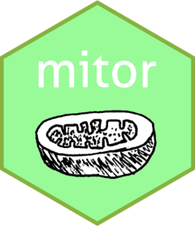

<!-- README.md is generated from README.Rmd. Please edit that file -->

# mitor 

<!-- badges: start -->
<!-- badges: end -->

## Overview

*mitor* is a kit that provides a set of tools for the handling of human
mitochondrial DNA (mtDNA) sequences and the identification and mapping
of non-synonymous variants in the 3D structure of the electron transport
chain (ETC) complexes in R.

Originally, *mitor* was developed as a pipeline for characterizing,
analyzing, and 3D visualizing the mutational landscape of archaic and
modern human mtDNA sequences. As we realized its potential for broader
applications and scenarios, we decided to develop it into a package, in
the hope that it will be useful to future users.

## Main features

Here is a summary of *mitor*’s main features. The R package allows you
to:

- **Fetch mitochondrial sequences** from the [NCBI nucleotide
  database](https://www.ncbi.nlm.nih.gov/nucleotide/) and download them
  on your local machine.
- **Haplogroup classification** of mtDNA sequences using
  [Haplogrep](https://haplogrep.i-med.ac.at/).
- **Handle a multiple sequence alignment (MSA) of human mtDNA
  sequences**, identify and extract the mitochondrial genes in the MSA,
  translate the coding sequences into amino acid sequences.
- **Identify variable positions** in a MSA of mtDNA sequences.
- **Mapping mitochondrial protein variable sites** for a given MSA onto
  the 3D structure of the ETC complexes and visualizing them using
  [PyMol](https://www.pymol.org/).
- **Query the [MITOMAP](https://www.mitomap.org/allelesearch.html)
  allele search database** to obtain information regarding variants in
  the human population at given positions.
- **Predict the structure of an amino acid sequence** using the
  [AlphaFold Server](https://alphafoldserver.com/). **Note:** this
  feature is currently under maintenance because some bugs were
  encountered.

## Installation

*mitor* can be installed directly from [GitHub](https://github.com/)
using the following commands:

``` r
# install.packages("devtools")
devtools::install_github("fil-tel/mitor")
```

**Note:** to ensure that *mitor* works correctly it is recommended to
manually install *Biostrings* from
[Bioconductor](https://www.bioconductor.org/) and *genbankr* from
[Github](https://github.com/gmbecker/genbankr) using the following
commands:

``` r
# Installation of Biostrings
if (!require("BiocManager", quietly = TRUE))
    install.packages("BiocManager")

BiocManager::install("Biostrings")
```

``` r
# Installation of genbankr
# install.packages("devtools")
devtools::install_github("gmbecker/genbankr")
```

## External software

*mitor* has several functions that relies on two external software:
[PyMol](https://www.pymol.org/) and
[Haplogrep](https://haplogrep.i-med.ac.at/). These **does not** come
with the package and they have to be installed separetly by the user.
You can install them following the instructions listed in their
websites:

- [PyMol](https://pymol.org/dokuwiki/doku.php?id=installation) -
  required for 3D visualization of mtDNA variant sites.
- [Haplogrep](https://haplogrep.readthedocs.io/en/latest/installation/) -
  required for haplogroup classification.

**Note that** if the software’s binaries are not found in the R’s PATH
variable, you need to manually add them adding these two lines to your
*.Renviron* file.

``` r
## Add haplogrep binary's directory to PATH variable
PATH="${PATH}:/path/to/haplogrep/"
## Add pymol binary's directory to PATH variable
PATH="${PATH}:/path/to/pymol"
```

The *.Renviorn* file is usually found in *~/*.

## AlphaFold Server

One of *mitor*’s features is predicting the 3D structure of a given
amino acid sequence using the [AlphaFold
Server](https://alphafoldserver.com/). In order to “unlock” this feature
it is necessary to follow this step-by-step guide:

- **Create an account.** [AlphaFold
  Server](https://alphafoldserver.com/) requires you to create an
  account (you can log in using your Google account).
- **Main page**. Once you created your account and logged in you will
  have something like this:

<figure>

<figcaption aria-hidden="true">AlphaFold Server main page.</figcaption>
</figure>

- **Copy request as cURL.** When submitting a job to the server, the
  server needs to know who is submitting the request. For this reason,
  AlphaFold Server is assigning you a token that identifies your account
  and some other information. As *mitor* needs to have access to this
  data to be able to submit jobs to the server, what you need to do now
  is to copy a call as cURL. Once on the main page, open the Web
  Developer Tools right-clicking anywhere in the page and selecting
  *Inspect(Q)*:

<figure>

<figcaption aria-hidden="true">Web Developer Tools</figcaption>
</figure>

- Now a section like this will open, select the Network option:

<figure>

<figcaption aria-hidden="true">Network</figcaption>
</figure>

- At this point, select one of the POST requests, right-click on it and
  select *Copy Value*, and then *Copy as cURL*:

<figure>

<figcaption aria-hidden="true">Copy as cURL</figcaption>
</figure>

- Now you are almost done, go to the directory where you installed
  *mitor* (find.package(“mitor”) in R), and paste the cURL request in
  the *curl.txt* file that you find in *mitor/extdata/*.

- **You are now done!**

## Operating System Support

*mitor* has only been tested on Linux (Ubuntu version 22.04). Some
features will definitely not work on other Operating Systems.

## Example

This is a basic example which shows you how to address some common
problems:

``` r
library(mitor)
```

I now define a query to fetch *Homo Sapiens* mtDNA sequences from the
[NCBI Nucleotide database](https://www.ncbi.nlm.nih.gov/nucleotide/).
For more information regarding the query structure check their
[website](https://www.ncbi.nlm.nih.gov/books/NBK44863/).

``` r
query <-
  "(016500[SLEN]:016600[SLEN]) AND mitochondrion[FILT] AND txid9606[orgn] NOT txid63221[orgn] NOT txid741158[orgn] NOT NC_012920.1[accn]"
```

And using the *fetch_seq* function I fetch the first 300 sequences.

``` r
path <- "data"
fetch_seq(query = query, dir_path = path, filename = "hs_mtdna.fa", n = 300)
```

I now load them and I save them adding the Cambridge Reference Sequence,
that comes with the package.

``` r
# Add the rCRS to the set of sequences 
seqs2align <- c(rCRS, hs_seqs)
# To save the sequences on a fasta file
Biostrings::writeXStringSet(x = seqs2align, filepath = "data/hs_mtdna.fa")
```

After performing a multiple sequence alignment, I load it in the
session. *mitor* comes already with an *DNAStringSet* object that
corresponds with this example.

``` r
my_msa
#> DNAStringSet object of length 301:
#>       width seq                                             names               
#>   [1] 16592 GATCACAGGTCTATCACCCTAT...CCTTAAATAAGACATCACGATG NC_012920
#>   [2] 16592 GATCACAGGTCTATCACCCTAT...CCTTAAATAAGACATCACGATG PV166900.1
#>   [3] 16592 GATCACAGGTCTATCACCCTAT...CCTTAAATAAGACATCACGATG PV166899.1
#>   [4] 16592 GATCACAGGTCTATCACCCTAT...CCTTAAATAAGACATCACGATG PV166898.1
#>   [5] 16592 GATCACAGGTCTATCACCCTAT...CCTTAAATAAGACATCACGATG PV166897.1
#>   ...   ... ...
#> [297] 16592 GATCACAGGTCTATCACCCTAT...CCTTAAATAAGACATCACGATG PQ306096.1
#> [298] 16592 GATCACAGGTCTATCACCCTAT...CCTTAAATAAGACATCACGATG PQ306095.1
#> [299] 16592 GATCACAGGTCTATCACCCTAT...CCTTAAATAAGACATCACGATG PQ306092.1
#> [300] 16592 GATCACAGGTCTATCACCCTAT...CCTTAAATAAGACATCACGATG PQ306091.1
#> [301] 16592 GATCACAGGTCTATCACCCTAT...CCTTAAATAAGACATCACGATG PQ306090.1
```

I can now for example extract the variants between the Cambridge
Reference Sequence and a certain sequence in the alignment
(e.g. PQ306091.1).

``` r
ex_var <- find_variants(my_msa, target = "PQ306091.1")
head(ex_var)
#>   Position Mutation         Type Ref  Alt
#> 1       35    35G>A Substitution   G    A
#> 2       36    36G>A Substitution   G    A
#> 3       73    73A>G Substitution   A    G
#> 4      143   143G>A Substitution   G    A
#> 5      263   263A>G Substitution   A    G
#> 6      303  303delC     Deletion   C <NA>
```

I am now interested in identifying and visualizing the variable position
of the residues in the mitochondrial protein subunits of the respiratory
complex I.

``` r
# Identify the coordinates of the genes in the MSA
coord_df <- genes_coord(my_msa)
# Extract the genes corresponding to coding sequences
cds <- extract_cds(my_msa, coord_df)
# Translate them into amino acid sequences
protein <- lapply(cds, translation)
```

Now we can identify the coordinates of the variable sites.

``` r
var_coords <- get_coords(protein)
head(var_coords)
#>   Protein Pos ChainID       x       y       z location
#> 1 MT-ATP6 106       N -15.896 -20.082  -5.560 membrane
#> 2 MT-ATP6  11       N -26.794  -4.253   4.743 membrane
#> 3 MT-ATP6 112       N -13.009 -24.642 -14.058   matrix
#> 4 MT-ATP6  16       N -38.242  -2.791   7.075 membrane
#> 5 MT-ATP6 161       N -13.706  -7.124  -1.564 membrane
#> 6 MT-ATP6 174       N -11.154  12.763   2.992 membrane
```

And use the function *map_variants* to visualize them.

``` r
map_variants(variants = var_coords, complex = "I")
```

This will open the GUI of a PyMol session with the variable sites
highlighted in red.

<figure>

<figcaption aria-hidden="true"><em>my_msa</em> variable sites for the
mitochondrial protein subunits of the respiratory complexI (in
red)</figcaption>
</figure>
